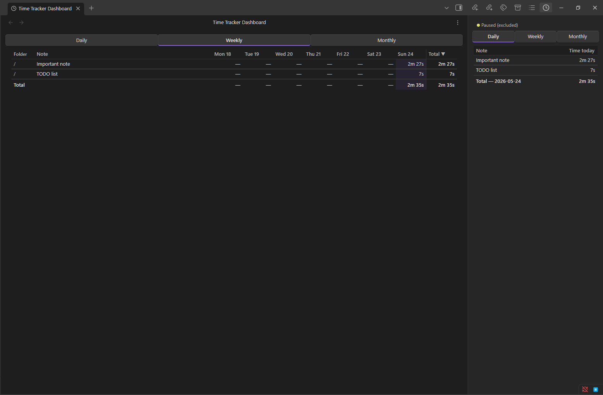
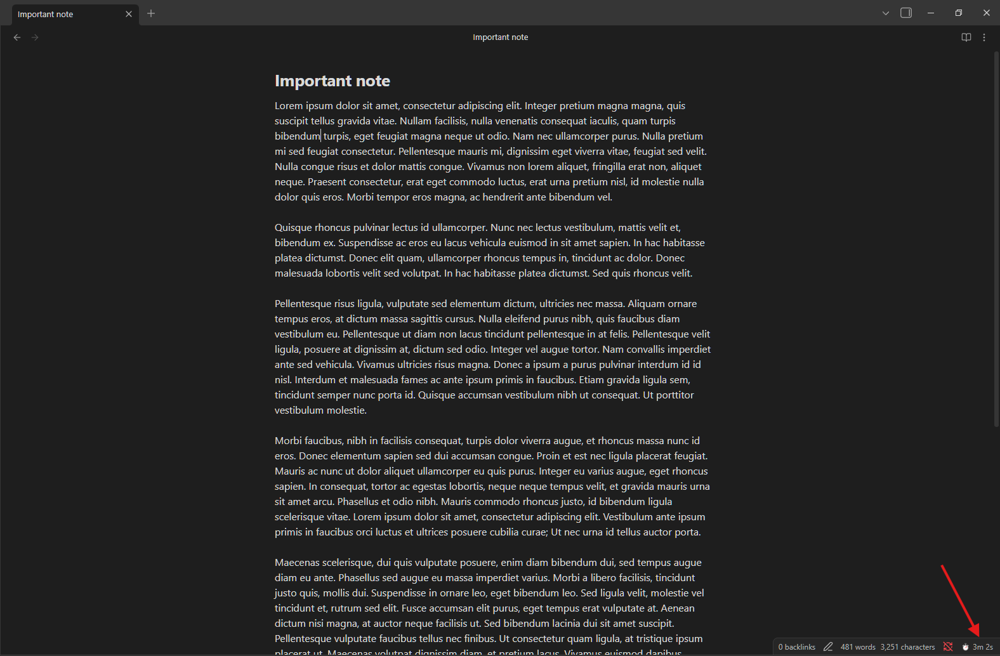
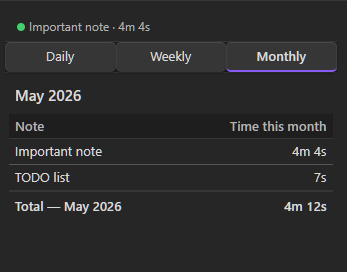
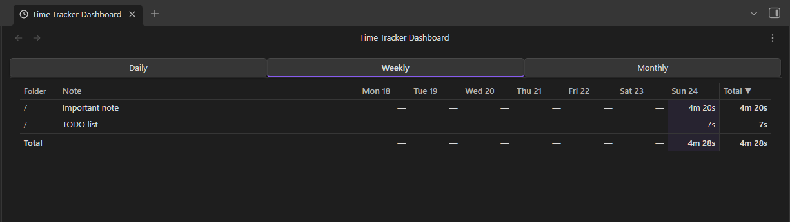
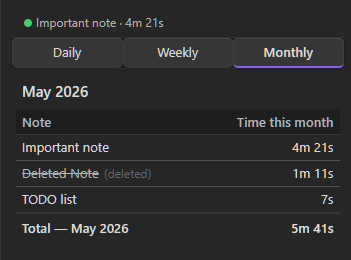
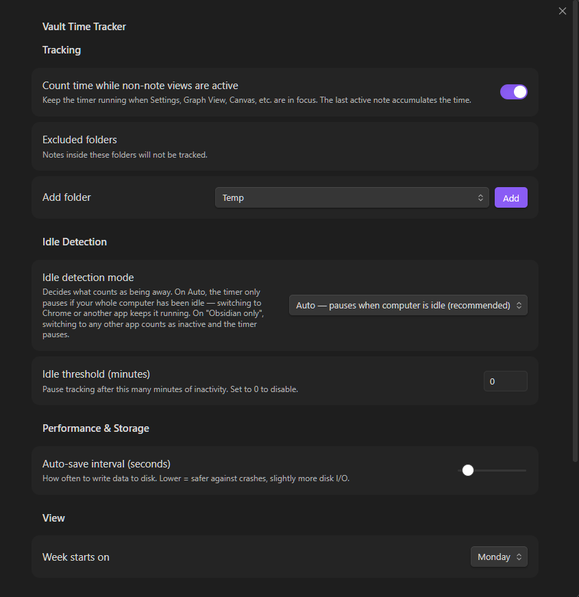

# Vault Time Tracker

Tracks how long you spend working on each note. The timer keeps running when you switch to another app.



---

## Why this exists

Most time trackers pause the moment you leave the app. The second you flip to a browser tab to look something up, or switch to a terminal, the clock stops. That's not how working on a note actually goes.

This plugin ties time to the note you have open, not to whether Obsidian is the active window. Open a note, work on it from wherever, come back — the time accumulates. Switch to a different note and tracking moves there.

## What it does

- Opens a note → tracking starts. Switch notes → first one pauses, second one begins. No manual interaction.
- The timer keeps running when you minimize Obsidian or switch to another app. Idle detection (off by default unless configured) can pause it after a set period with no keyboard or mouse activity.
- A **sidebar panel** with Daily, Weekly, and Monthly tabs shows your time per note over each period.
- A **full-page dashboard** (opens in a new editor tab) adds a Folder column, full note names without truncation, full-path tooltips on hover, and sortable columns. Useful when you have several notes with similar names across different folders and the narrow sidebar makes them hard to tell apart.
- The status bar shows the currently-tracked note and a live running total for today.
- Notes you've deleted stay in the history with a `(deleted)` label.
- Renames are tracked: time follows the note to its new name.
- Data is saved to disk every 30 seconds, so a hard crash costs at most one save interval.







## Install

### Community Plugins

Search "Vault Time Tracker" in Settings → Community Plugins → Browse, install, and enable.

> Submission to the community plugin store is in progress. Until it's approved, use the manual method below.

### Manual

1. Go to [Releases](https://github.com/rafaelmehdiyev/vault-time-tracker/releases) and download `main.js`, `manifest.json`, and `styles.css` from the latest release.
2. Create `<your vault>/.obsidian/plugins/vault-time-tracker/` if it doesn't exist.
3. Copy all three files into that folder.
4. In Obsidian → Settings → Community Plugins, enable **Vault Time Tracker**.

## Usage

**Sidebar** — click the clock icon in the ribbon or run `Open Time Tracker`. The panel has three tabs: Daily, Weekly, Monthly. Each shows the notes you've worked on during that period and how long you spent on each.

**Dashboard** — click the table icon in the ribbon or run `Open Time Tracker Dashboard`. This opens as a full-width tab in the editor area. Click any column header to sort by folder, note name, or time. The Folder column and full-path tooltip on hover make it easier to distinguish notes when you have several with similar names.

Clicking any note name in either view opens that note.



Deleted notes stay in the record. Their names appear with a strikethrough and a `(deleted)` label so you know the note is gone but the time isn't.

## Settings



| Setting | Default | What it does |
|---|---|---|
| Count time while non-note views active | On | Keep timing the last note when you open Settings, Graph, or other non-note views. Turn off if you want the timer to stop whenever you leave an editor. |
| Excluded folders | — | Pick folders from a dropdown. Notes inside excluded folders are never tracked. |
| Idle detection mode | Auto | What counts as being away. Auto pauses only when your whole computer is idle, so switching to another app keeps the timer running. "Obsidian only" pauses whenever you switch to any other app. |
| Idle threshold | 0 (off) | How many minutes of inactivity before the timer pauses. 0 means never pause. |
| Auto-save interval | 30 s | How often time data is written to disk. |
| Week starts on | Monday | Changes the day order in the Weekly tab. |

At the bottom of the settings tab: **Export JSON** saves a full copy of your data to the vault root, and **Clear all data** wipes everything after a confirmation prompt.

## Your data

All data is stored in `.obsidian/plugins/vault-time-tracker/data.json` inside your vault. Nothing is sent anywhere.

The file contains three things: `dailyTotals` (per-day, per-note totals in milliseconds — kept forever), `sessions` (detailed session records with start/end times, pruned after the retention window), and `renames` (a short rename log, also pruned).

## Limitations

- **Desktop only.** The plugin uses Electron APIs for idle detection and background tracking. It won't run on mobile.
- **One window per vault.** Opening the same vault in two Obsidian windows is unsupported and can cause double-counting.
- **System idle fallback.** If Electron's `powerMonitor.getSystemIdleTime()` isn't available in your Obsidian build, idle detection falls back to watching activity inside Obsidian's window. Time spent in other apps will still count as active in that case.
- **Timezone changes don't rewrite history.** If you change the timezone setting, past records stay on the dates they were originally written. Only new sessions use the updated timezone.

## Development

```bash
npm install
npm run dev      # watch mode, rebuilds on change
npm run build    # production build → main.js
npm test         # unit tests
```

Copy `main.js`, `manifest.json`, and `styles.css` into your test vault's plugin folder and reload the plugin.

## License

MIT
